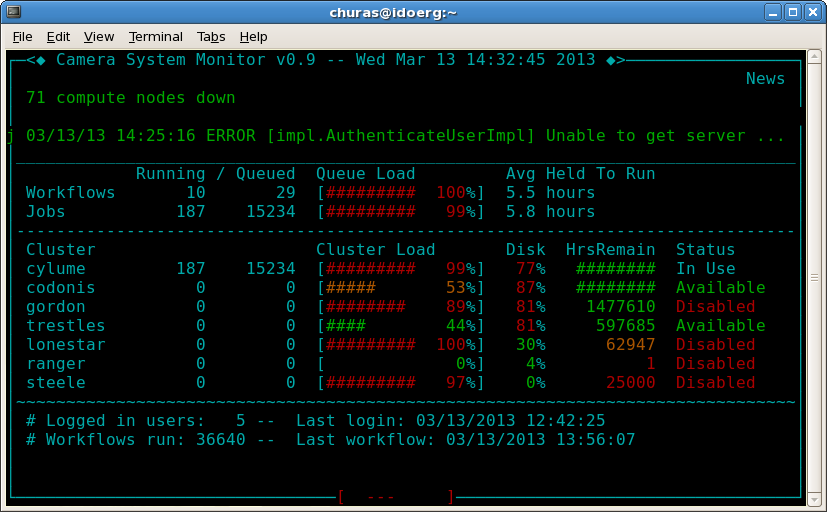

camerastatus
============

CAMERA status is a ncurses based UI providing status of CAMERA system

Requirements
============

The following applications are libraries are required to compile and run
camera status.  

 autoconf
 make
 g++
 ncurses or ncursesw library
 libcurl >= 7.15.5
 libtool

 libcppunit (to build and run the test cases)

Compiling
=========
 
To build the application run the following commands

 ./autogen.sh
 ./configure
 make
 make test (requires libcppunit)
 make install

Installation on Ubuntu 12.04
============================

Several packages need to be installed to compile and run camerastatus on Ubuntu.  To
install these packages run this command from a terminal:
 
 sudo apt-get install autoconf libncurses5-dev libcurl4-openssl-dev curl libtool g++

After running the above command simply follow the steps above in the "Compiling" section

